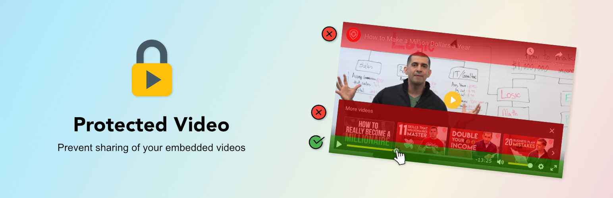

# Protected Video 

WordPress plugin that provides a Gutenberg block and traditional Shortcode for embedding YouTube/Vimeo videos, in a way that prevents users easily accessing the underlying video.

## Features

- [Plyr](https://plyr.io/) player used to overlay default player with custom controls
- Player modifications to always prevent clicking the default player
- Encodes video ID in HTML to prevent finding it via “View Source”
- Settings page e.g. to configure the player theme to match your site

[View Player Demo](https://protected-video.alecrust.com/)

## Installation

Install from the [WordPress Plugin Directory](https://wordpress.org/plugins/protected-video/) or grab a ZIP from
[Releases](https://github.com/AlecRust/protected-video/releases). This plugin supports [Git Updater](https://github.com/afragen/git-updater).

To embed a video either search for "Protected Video" in the Block Editor, or use the Shortcode e.g.

    [protected_video url="https://youtu.be/c_hO_fjmMnk" service="youtube"]

## Development

### Requirements

- [Node.js](https://nodejs.org/)
- [Docker](https://www.docker.com/)

Start a WordPress instance for developing this plugin by running:

1. `npm install`
2. `npm run build`
3. `npm run env start`

Use `npm start` to watch and rebuild block source files as they change.

Use `npm run start:demo` to launch the demo page on a local server.
